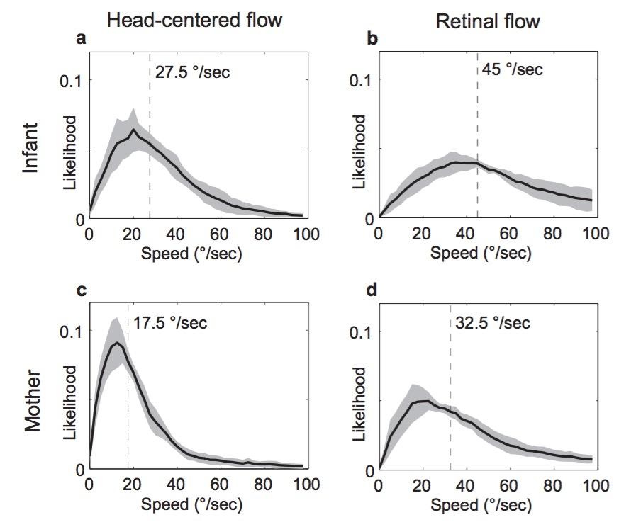
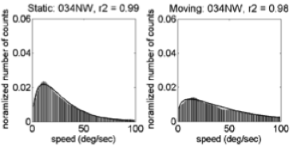

##  {.flexbox .vcenter}

<div class="centered">

<span class="talktitle">Go with the flow: The development of behavioral sensitivity and brain responses to optic flow</span>

### **Rick O. Gilmore**

*Support*: NSF BCS-1147440, NSF BCS-1238599, NICHD U01-HD-076595


</div>

## Questions

- What is optic flow?
- Why is optic flow important?
- How does optic flow sensitivity develop?
- How do brain systems for processing optic flow develop?
- What shapes these patterns of development?
  
## Approach

- **EEG measures** of brain responses to optic flow
- **Psychophysical measures** of optic flow perception
- **Empirical measures** of experienced optic flow across development from head-mounted video cameras
- **Computational simulations** of optic flow experiences across developmental milestones

## Claims

- Brain and behavioral responses to optic flow develop throughout childhood
    + Still immature in 5-8 year-olds
- Changes in the statistics of of optic flow children experience shape development in infancy, and likely beyond

## A pitch and a prediction

- Open, transparent, and reproducible research practices -- including open data sharing -- have changed my work.
- For the better.
- Within 10 years (maybe 5) it will be impossible to get funded or published if you have not adopted them.
- Don't worry; It will be good for us and for science.

# What's and why's

## What is Optic Flow?

- Structured pattern of visual motion generated by observer movement

----

<iframe width="560" height="315" src="https://www.youtube.com/embed/o27tIdYggY0" frameborder="0" allowfullscreen></iframe>

<div class="notes">
Cute kid playing hide and seek wearing GoPro camera.
</div>

## Types of Optic Flow {.flexbox .vcenter}

<div class="centered">

</div>

---

<div class="centered">
<a href="">

</a>

[[@yu_receptive_2010]](http://doi.org/10.1152/jn.01085.2009)
</div>

<div class="notes">
Figure from Yu et al., 2010 of MSTd receptive fields.
These parse the space of different types of optic flow. You can think of them as basic features of flow.
</div>

## Why is optic flow important?

- Geometry of environment
    + Surface layout, orientation
    + Object motion
- Direction, speed of self-motion
    + Rotation, translation
    + Visual proprioception (eye vs. head vs. body)
    
## Flow and self-motion

<div class="centered">

</div>

<!--

| Flow Type | Movement Type |
|-----------|---------------|
| Expansion/Contraction | Forward/backward head/body |
| Rotation              | Rotation of head/body |
| Up/down/left/right | Translation of eyes/head/body |

-->

## How Does Optic Flow Sensitivity Develop?

- Sensitivity at birth, [[@jouen_optic_2000]](10.1016/S0163-6383(01)00044-3)

## [[@gilmore_development_2007]](http://doi.org/10.1017/S0952523807070769)

4-6 mo-old infants: Larger brain responses to **linear** patterns.

---

<div class="centered">


## [[@hou_spatio-temporal_2009]](http://doi.org/10.1016/j.visres.2009.08.007)

4-6 mo-old infants: Larger brain responses to **faster** speeds.

---

<div class="centered">

</div>

## [[@kiorpes_development_2004]](http://doi.org/10.1017/S0952523804216054)

Sensitivity to slow (linear) speeds develops slowly in monkeys.

---

<div class="centered">


## Gaps

- Brain and behavioral responses in childhood?
- What influences developmental shifts?
    + Why **fast speeds**
    + Why **linear patterns**?

## How Do Children's Brains Respond to Flow?

- If infant-like: stronger responses to **fast, linear flows**.
- If adult-like: stronger responses to **slow, radial flows**.
- If in-between:
    + fast + radial OR
    + slow + linear
    
# Brain responses to flow

## Methods

- Time-varying optic flow patterns.
- Steady-state visual evoked potentials (SSVEPs).
    + Event-related EEG technique.
    + Phase-locked responses at low-order harmonics.
- n=29 4-8 year-olds.

## 2 deg/s translation {.smaller}

<div class="centered">
<video width="750" height="450" controls>
  <source src="https://nyu.databrary.org/slot/9825/-/asset/11635/download?inline=true" type="video/mp4">
  Your browser does not support the video tag.
</video>
</br>
<https://nyu.databrary.org/volume/75/slot/9825/->

## 4 deg/s rotation {.smaller}

<div class="centered">
<video width="750" height="450" controls>
  <source src="https://nyu.databrary.org/slot/9825/-/asset/11649/download?inline=true" type="video/mp4">
  Your browser does not support the video tag.
</video>
</br>
<https://nyu.databrary.org/volume/75/slot/9825/->

## 8 deg/s radial {.smaller}

<div class="centered">
<video width="750" height="450" controls>
  <source src="https://nyu.databrary.org/slot/9825/-/asset/11645/download?inline=true" type="video/mp4">
  Your browser does not support the video tag.
</video>
</br>
<https://nyu.databrary.org/volume/75/slot/9825/->

<!--
## Displays

- Time varying coherence/signal-to-noise ratio (SNR), 100%/0%
- Modulation frequency 1.2 Hz (1F1), dot update rate 24 Hz (1F2)
- {Linear, Radial, Rotation} x {2 deg/s, 4 deg/s, 8 deg/s}

## Data analysis

- Fourier analysis (frequency domain)
    + generates complex domain (real, imaginary) components
    + time-varying signals have amplitude, phase
- [Codepen Demo](http://codepen.io/anon/pen/jPGJMK)

## Data analysis

- Mixed effects MANOVA to capture phase, amplitude
    + *Pattern* (radial, rotation, linear) and *Speed* (2, 4, 8 deg/s) as fixed effects
    + Individual means as random factors
- Analyze channels independently with conservative $\alpha$ (.0005)
-->

## [1F1 Channel-Wise Results](https://raw.githubusercontent.com/gilmore-lab/gilmore-thomas-fesi-2015/master/figs/1F1/child/figX-channel-wise-effects-1.png)

<div class="centered">

</div>

## [1F1 Channels *p* < .0005](https://raw.githubusercontent.com/gilmore-lab/gilmore-thomas-fesi-2015/master/figs/1F1/child/figX-vector-amplitude-barplots-pattern-1.png) 

<div class="centered">

</div>

<!--
----

<div class="centered">

</div>
-->

## [Complex Domain Plot of 1F1 Channels](https://raw.githubusercontent.com/gilmore-lab/gilmore-thomas-fesi-2015/master/figs/1F1/child/figX-complex-domain-plots-pattern-1.png)

<div class="centered">

</div>

## 1F1 Results Summary

- Highly responsive channels over right lateral cortex
- Radial & rotation >> translation
- Amplitude and phase differences

<!--
## [2F1 Channel-Wise Results](https://raw.githubusercontent.com/gilmore-lab/gilmore-thomas-fesi-2015/master/figs/2F1/child/figX-channel-wise-effects-1.png)

<div class="centered">

</div>
-->

## [3F1 Channel-Wise Results](https://rawgit.com/gilmore-lab/gilmore-thomas-fesi-2015/master/figs/3F1/child/channel-wise-effects-1.png)

<div class="centered">

</div>

## [3F1 Channels *p* < .0005](https://raw.githubusercontent.com/gilmore-lab/gilmore-thomas-fesi-2015/master/figs/3F1/child/figX-vector-amplitude-barplots-speed-1.png)

<div class="centered">

</div>

<!--
----

<div class="centered">

</div>

-->

## [Complex Domain Plot of 3F1 Channels](https://rawgit.com/gilmore-lab/gilmore-thomas-fesi-2015/master/figs/3F1/child/figX-complex-domain-plots-speed-1.png)

<div class="centered">

</div>

## 3F1 Results Summary

- Highly responsive channels over medial cortex
- Speed, but not pattern tuned, 2 < 4 = 8 deg/s
- Amplitude and phase differences

<!--
## [1F2 Channel-Wise Results](https://raw.githubusercontent.com/gilmore-lab/gilmore-thomas-fesi-2015/master/figs/1F2/child/figX-channel-wise-effects-1.png)

<div class="centered">

</div>

## [1F2 Channels *p* < .0005](https://raw.githubusercontent.com/gilmore-lab/gilmore-thomas-fesi-2015/master/figs/1F2/child/figX-vector-amplitude-barplots-speed-1.png)

<div class="centered">

</div>

----

<div class="centered">

</div>

-->

## Results Summary

- Anatomical separation of responses
    + speed (medial)
    + vs. pattern (lateral)
- Radial & rotation <> translation, phase & amplitude
- Speed tuning

## [Children's 1F1](https://raw.githubusercontent.com/gilmore-lab/gilmore-thomas-fesi-2015/master/figs/1F1/child/figX-channel-wise-effects-1.png)

<div class="centered">

</div>

## [Adults' 1F1](https://raw.githubusercontent.com/gilmore-lab/gilmore-thomas-fesi-2015/master/figs/1F1/adult/figX-channel-wise-effects-1.png)

<div class="centered">

</div>

## [Children's 3F1](https://raw.githubusercontent.com/gilmore-lab/gilmore-thomas-fesi-2015/master/figs/3F1/child/figX-channel-wise-effects-1.png)

<div class="centered">

</div>

## [Adults' 3F1](https://raw.githubusercontent.com/gilmore-lab/gilmore-thomas-fesi-2015/master/figs/3F1/adult/figX-channel-wise-effects-1.png)

<div class="centered">

</div>

<!--
## [Children's 1F2](https://raw.githubusercontent.com/gilmore-lab/gilmore-thomas-fesi-2015/master/figs/1F2/child/figX-channel-wise-effects-1.png)

<div class="centered">

</div>

## [Adults' 1F2](https://raw.githubusercontent.com/gilmore-lab/gilmore-thomas-fesi-2015/master/figs/1F2/adult/figX-channel-wise-effects-1.png)

<div class="centered">

</div>
-->

## Developmental Effects

- Children adult-like in many respects
    + Lateral "pattern" responses @ 1F1
    + Medial "speed" responses @ 3F1 (and 1F2)
- Children activate fewer channels

# Behavioral responses to flow

## Methods

- Time-varying optic flow
    + Radial, linear
    + {2 deg/s, 8 deg/s}
    + {5, 10, 15, 20%} coherence (adults)
    + {15, 30, 45, 60%} and {20, 40, 60, 80%} (children)
    
## Methods

- Side by side displays 
    + Signal/noise
    + Choose side with signal
    + 2AFC, 10 s response period
    
----

<div class="centered">

</div>

## Methods

- n=34 children (4.3–8.6 yrs, M = 6.5 yrs, 19 Female)
    + <https://nyu.databrary.org/volume/218>
- n=30 adults (18.7–23.9 yrs, M = 20.8 yrs, 16 female)
    + <http://doi.org/10.17910/B7V88T>

<!--
## Methods

- Generalized linear mixed effects modeling (*lmer* in *R*)
    + Random intercepts by participant
    + Coherence, Pattern, Speed as fixed effects
- Probit link function (2AFC)
-->

## Children's responses *p*(correct)

<div class="centered">

</div>

## Adults' responses *p*(correct)

<div class="centered">

</div>

## Statistical modeling

- [Children](https://rawgit.com/gilmore-lab/moco-3-pattern-psychophysics/master/child-laminar-radial/html/child.models.html)
- [Adults](https://rawgit.com/gilmore-lab/moco-3-pattern-psychophysics/master/child-laminar-radial/html/adult.models.html)

## Speed effects in children

<div class="centered">

</div>

## Speed effects in adults

<div class="centered">

</div>

## Pattern effects in children

<div class="centered">

</div>

## Pattern effects in adults

<div class="centered">

</div>

<!--
## Children's RT

<div class="centered">

</div>

## Adults' RT

<div class="centered">

</div>
-->

## Behavioral Summary

- Children's EEG: highest to **fast** speeds, **radial** (& rotational) patterns
- Children's behavior: more accurate to detect **fast** speeds, **radial** patterns
- Adults more accurate to detect **slow** speeds, **radial** patterns

<!-- ## [Children's 3F1](https://raw.githubusercontent.com/gilmore-lab/gilmore-thomas-fesi-2015/master/figs/3F1/child/figX-vector-amplitude-barplots-speed-1.png) -->

<!-- <div class="centered"> -->
<!--  -->
<!-- </div> -->

<!-- ## [Children's 1F1](https://raw.githubusercontent.com/gilmore-lab/gilmore-thomas-fesi-2015/master/figs/1F1/child/figX-vector-amplitude-barplots-pattern-1.png)  -->

<!-- <div class="centered"> -->
<!--  -->
<!-- </div> -->

# What influences developmental shifts?

---

<div class="centered">

</div>

## Potential factors

- External
    + Environment
- Internal
    + Posture
    + Locomotion, head, eye movements

## Head mounted eye tracker data from "coupled" infant/mom dyads {.smaller}

<div class="centered">

</div>

Adolph, K. (2015). Active vision in passive locomotion: real-world free viewing in infants and adults. Databrary. Retrieved February 18, 2017 from <http://doi.org/10.17910/B7.123>

<!--
## Infants {.smaller}

<div class="centered">
<video width="640" height="480" controls>
  <source src="https://nyu.databrary.org/slot/8239/-/asset/19179/download?inline=true" type="video/mp4">
  Your browser does not support the video tag.
</video>
<https://nyu.databrary.org/slot/8239/-/asset/19179/download?inline=true>
</div>

## Mothers {.smaller}

<div class="centered">
<video width="640" height="480" controls>
  <source src="https://nyu.databrary.org/slot/8239/-/asset/19181/download?inline=true" type="video/mp4">
  Your browser does not support the video tag.
</video>
<https://nyu.databrary.org/slot/8239/-/asset/19181/download?inline=true>
<div>

-->

---

<div class="centered"> 
<video width="640" height="480" controls>
  <source src="https://nyu.databrary.org/slot/11680/0,24500/asset/41871/download?inline=true" type="video/mp4">
  Your browser does not support the video tag.
</video>
</div>

---

<div class="centered">
<video width="640" height="480" controls>
  <source src="https://nyu.databrary.org/slot/11680/25500,50000/asset/41873/download?inline=true" type="video/mp4">
  Your browser does not support the video tag.
</video>
</div>

---

<div class="centered">
<video width="640" height="480" controls>
  <source src="https://nyu.databrary.org/slot/11680/51000,75500/asset/41875/download?inline=true" type="video/mp4">
  Your browser does not support the video tag.
</video>
</div>

## Findings {.smaller}

<div class="centered">


[[@raudies_visual_2014]](http://doi.org/10.1162/NECO_a_00645)
</div>

## Findings

- Infant (passengers) experience faster visual speeds than mother
- Controlling for speed of locomotion, environment

## Experienced flow across cultures {.smaller}

<div class="centered">
<video width="532" height="400" controls>
  <source src="https://nyu.databrary.org/slot/11630/1567557,1747248/asset/39854/download?inline=true" type="video/mp4">
  Your browser does not support the video tag.
</video>

Jayaraman, S., Smith, L.B., Raudies, F. & Gilmore, R.O. (2014). Natural Scene Statistics of Visual Experience Across Development and Culture. Databrary. Retrieved February 18, 2017 from <http://doi.org/10.17910/B7988V>
</div>

----

<div class="centered">


</div>

---

<div class="centered">
| Country | Females | Males | Age (wks) | Coded video Hrs        |
|---------|---------|-------|-----------|------------------|
| India   | 17      | 13    | 3-63      | 3.1 (0.5-6.0) |
| U.S.    | 15      | 19    | 4-62      | 4.6 (0.2-7.6)    |
</div>

## *p*(moving) vs. stationary

<div class="centered">

</div>

## Illustrative Speed Histograms - 6 weeks {.flexbox .vcenter}

<div class="centered">


</div>

## Illustrative Speed Histograms -- 34 weeks {.flexbox .vcenter}

<div class="centered">


</div>

## Illustrative Speed Histograms -- 58 weeks {.flexbox .vcenter}

<div class="centered">


</div>

<!--
## Empirical Pattern Distributions

- Correlation with 'canonical' flow patterns
    + radial
    + rotational
    + translational
-->

## Pattern Correlation Results

<div class="centered">

</div>

## Conclusions: Measuring experienced flow

- Time stationary >> time in motion
- Time in motion increases, faster in U.S.
- Fast speeds, broad speed distributions
- Linear flow >> radial or rotational flow

## Simulating developmental change {.flexbox .vcenter .smaller}

<div class="centered">
$\begin{pmatrix}\dot{x} \\ \dot{y}\end{pmatrix}=\frac{1}{z}
\begin{pmatrix}-f & 0 & x\\ 0 & -f  & y \end{pmatrix}
\begin{pmatrix}{v_x{}}\\ {v_y{}} \\{v_z{}}\end{pmatrix}+
\frac{1}{f}
\begin{pmatrix}
xy & -(f^2+x^2) & fy\\ 
f^2+y^2 & -xy & -fy
\end{pmatrix}
\begin{pmatrix}
\omega_{x}\\ 
\omega_{y}\\ 
\omega_{z}
\end{pmatrix}$

**Geometry of environment/observer**: $(x, y, z)$</br>
**Translational speed**: $(v_x, v_y, v_z)$</br>
**Rotational speed**: $(\omega_{x}, \omega_{y}, \omega{z})$</br>
**Retinal flow**: $(\dot{x}, \dot{y})$
</div>

## Parameters For Simulation

| Parameter | Crawling Infant | Walking Infant |
|-----------|-----------------|----------------|
| Eye height| 0.30 m          | 0.60 m         |
| Locomotor speed | 0.33 m/s  | 0.61 m/s       |
| Head tilt | 20 deg          | 9 deg          |

<div class="centered">
</br>

</br>
[[@kretch_crawling_2014]](http://dx.doi.org/10.1111/cdev.12206)
</div>

## Parameters for Simulation

| Geometric Feature        | Distance |
|--------------------------|----------|
| Side wall                | +/- 2 m  |
| Side wall height         | 2.5 m    |
| Distance of ground plane | 32 m     |
| Field of view width      | 60 deg   |
| Field of view height     | 45 deg   |

## Simulating Flow Fields {.flexbox .vcenter}

<div class="centered">


[[@gilmore_what_2015]](http://doi.org/10.1109/DEVLRN.2015.7345450)
</div>

## Flow Direction Distributions by Geometry & Posture

<div class="centered">


[[@gilmore_what_2015]](http://doi.org/10.1109/DEVLRN.2015.7345450)
</div>

## Simulated Flow Speeds (m/s) {.flexbox .vcenter}

<div class="centered">
| Type of Locomotion | Ground Plane | Room | Side Wall | Two Walls |
|--------------------|--------------|------|-----------|-----------|
| Crawling           | 14.41        | 14.42| 14.43     |14.62      |
| Walking            | 9.38         | 8.56 | 7.39      |9.18       |

</br>
</br>
[[@gilmore_what_2015]](http://doi.org/10.1109/DEVLRN.2015.7345450)
</div>

## Simulation Conclusions

- Posture influences optic flow speeds & patterns
    - Crawling: faster speeds, more translational flow
    - Proximity to ground and pitch of head
- Geometry matters relatively little

## Summing up

- Infants commonly experience fast, linear optic flows
    + Body size, posture, head position/stability
    + Similar patterns across cultures
- Brain and behavioral responses to optic flow develop throughout childhood
    + Still immature in 5-8 year-olds
- Changes in the statistics of experienced optic flow shape brain and behavioral development in infancy, and likely beyond

----

<div class="centered">

</div>

# A good crisis?

---

<div class="centered">

</div>

Open, transparent, and reproducible research practices -- including open data sharing -- have changed my work.

---

<iframe src="https://databrary.org">
</iframe>

## Let's not waste a good crisis

- [Databrary.org](http://databrary.org): share video, procedures/tasks, data
    + Video the **best** way to capture, share procedures
    + Gilmore, R. O., & Adolph, K. E. (2017, February 9). Video can make science more open, transparent, robust, and reproducible. Retrieved from <http://osf.io/3kvp7>
- [Open Science Framework (OSF)](http://osf.io): share non-identifiable materials, data

## Let's not waste a good crisis

- [RStudio](https://www.rstudio.com) or [Jupyter](http://jupyter.org) for reproducible notebooks, workflows, analyses, & presentations
- [GitHub](http://github.com): share flat-files & code, version control
- PSY 511 Spring 2016 course, <http://psu-psychology.github.io/psy-511-reproducible-research-spring-2017>

## Keep in touch

- This talk: <https://github.com/gilmore-lab/temple-2017-02-27>
- Lab site: <http://gilmore-lab.github.io>
- GitHub: <http://github.com/gilmore-lab>
- [Databrary](http://databrary.org/party/6)
- Email: rogilmore@psu.edu

## Acknowledgements

*Collaborators*: Karen Adolph (NYU); Jeremy Fesi (U.S. Marine Corps Research); John Franchak (UC-Riverside); Swapnaa Jayaraman (Indiana University); Kari Kretch; Ennio Mingolla, (Northeastern); Florian Raudies (LinkedIn); Amanda Thomas (Swarthmore).

*Support*: NSF BCS-1147440, NSF BCS-1238599, NICHD U01-HD-076595

## Stack {.smaller}

This talk was produced in [RStudio](http://rstudio.com) version 1.0.136 on `r Sys.Date()`. The code used to generate the slides can be found at <http://github.com/gilmore-lab/temple-2017-02-27/>. Information about the R Session that produced the code is as follows:

```{r session-info}
sessionInfo()
```

## References {.smaller}
