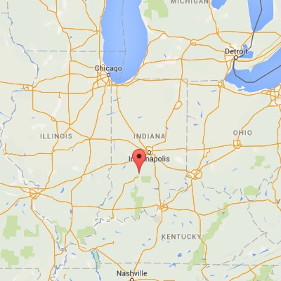
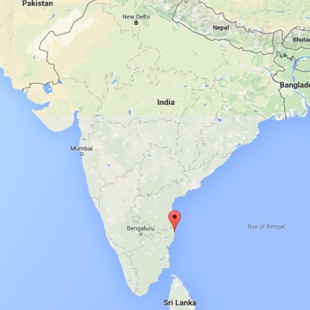
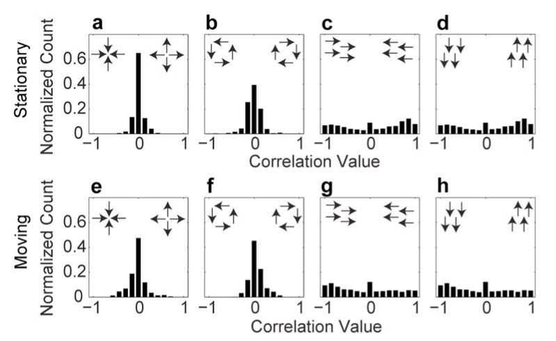

Temple 2017-02-27
================
Rick Gilmore
2017-02-22 17:38:20

------------------------------------------------------------------------

<span class="talktitle"> **Go with the flow: The development of behavioral sensitivity and brain responses to optic flow** </span>

### Rick O. Gilmore

*Support*: NSF BCS-1147440, NSF BCS-1238599, NICHD U01-HD-076595

Questions
---------

-   What is optic flow?
-   Why is optic flow important?
-   How does optic flow sensitivity develop?
-   How do brain systems for processing optic flow develop?
-   What shapes these patterns of development?

Approach
--------

-   **EEG measures** of brain responses to optic flow
-   **Psychophysical measures** of optic flow perception
-   **Computational simulations** of optic flow experiences across developmental milestones
-   **Empirical measures** of experienced optic flow across development from head-mounted video cameras

Claims
------

-   Brain and behavioral responses to optic flow develop throughout childhood
    -   Still immature in 5-8 year-olds
-   Changes in the statistics of of optic flow children experience shape development in infancy, and likely beyond

A pitch and a prediction
------------------------

-   Open, transparent, and reproducible research practices -- including open data sharing -- have changed my work.
-   For the better.
-   Within 10 years (maybe 5) it will be impossible to get funded or published if you have not adopted them.
-   Don't worry; It will be good for us and for science.

What is Optic Flow?
-------------------

-   Structured pattern of visual motion generated by observer movement

------------------------------------------------------------------------

<iframe width="560" height="315" src="https://www.youtube.com/embed/o27tIdYggY0" frameborder="0" allowfullscreen>
</iframe>
Cute kid playing hide and seek wearing GoPro camera.

Types of Optic Flow
-------------------


------------------------------------------------------------------------

<a href="">  </a>

[(Yu et al. 2010)](http://doi.org/10.1152/jn.01085.2009)

Figure from Yu et al., 2010 of MSTd receptive fields. These parse the space of different types of optic flow. You can think of them as basic features of flow.

Why is optic flow important?
----------------------------

-   Geometry of environment
    -   Surface layout, orientation
    -   Object motion
-   Direction, speed of self-motion
    -   Rotation, translation
    -   Visual proprioception (eye vs. head vs. body)

Flow types and self-motion types
--------------------------------

| Flow Type             | Movement Type                 |
|-----------------------|-------------------------------|
| Expansion/Contraction | Forward/backward head/body    |
| Rotation              | Rotation of head/body         |
| Up/down/left/right    | Translation of eyes/head/body |

How Does Optic Flow Sensitivity Develop?
----------------------------------------

-   Sensitivity at birth, [(Jouen et al. 2000)](10.1016/S0163-6383(01)00044-3)

[(R. Gilmore et al. 2007)](http://doi.org/10.1017/S0952523807070769)
--------------------------------------------------------------------

4-6 mo-old infants: Larger brain responses to linear patterns.

------------------------------------------------------------------------

<div class="centered">


[(Hou et al. 2009)](http://doi.org/10.1016/j.visres.2009.08.007)
----------------------------------------------------------------

-   4-6 mo-old infants: Larger brain responses to faster speeds.

------------------------------------------------------------------------


[(Kiorpes and Movshon 2004)](http://doi.org/10.1017/S0952523804216054)
----------------------------------------------------------------------

Sensitivity to slow (linear) speeds develops slowly in monkeys

------------------------------------------------------------------------

<div class="centered">


Gaps
----

-   Brain and behavioral responses in childhood
-   Linking brain and behavioral responses
-   What influences developmental shifts?
    -   Why **fast speeds**
    -   Why **linear patterns**?

How Do Children's Brains Respond to Flow?
-----------------------------------------

-   If infant-like: stronger responses to **fast, linear flows**
-   If adult-like: stronger responses to **slow, radial flows**
-   If in-between:
    -   fast + radial OR
    -   slow + linear

Brain Responses to Flow
-----------------------

Gilmore, R.O., Thomas, A.L., & Fesi, J.D (2016). Children's brain responses to optic flow vary by pattern type and motion speed. PLoS ONE. [doi: 10.1371/journal.pone.0157911](http://doi.org/10.1371/journal.pone.0157911). Materials on Databrary at <http://doi.org/10.17910/B7QG6W>.

Fesi, J.F., Thomas, A.L., & Gilmore, R.O. (2014). Cortical responses to optic flow and motion contrast across patterns and speeds. *Vision Research*, *100*, 56–71. [doi:10.1016/j.visres.2014.04.004](http://doi.org/10.1016/j.visres.2014.04.004). Materials on Databrary at <http://doi.org/http://doi.org/10.17910/B7101Z>.

Methods
-------

-   Time-varying optic flow patterns
-   Steady-state visual evoked potentials (SSVEPs)
    -   Event-related EEG technique
    -   Focus on phase-locked, low-order harmonics
-   n=29 4-8 year-olds

2 deg/s translation
-------------------

<div class="centered">
<video width="750" height="450" controls>
<source src="https://nyu.databrary.org/slot/9825/-/asset/11635/download?inline=true" type="video/mp4"> Your browser does not support the video tag.
</video>
</br> <https://nyu.databrary.org/volume/75/slot/9825/->

4 deg/s rotation
----------------

<div class="centered">
<video width="750" height="450" controls>
<source src="https://nyu.databrary.org/slot/9825/-/asset/11649/download?inline=true" type="video/mp4"> Your browser does not support the video tag.
</video>
</br> <https://nyu.databrary.org/volume/75/slot/9825/->

8 deg/s radial
--------------

<div class="centered">
<video width="750" height="450" controls>
<source src="https://nyu.databrary.org/slot/9825/-/asset/11645/download?inline=true" type="video/mp4"> Your browser does not support the video tag.
</video>
</br> <https://nyu.databrary.org/volume/75/slot/9825/->

Displays
--------

-   Modulate coherence/signal-to-noise ratio (SNR), 100%/0%
-   Modulation frequency 1.2 Hz (1F1), dot update rate 24 Hz (1F2)
-   Cross pattern and speed

Data analysis
-------------

-   Fourier analysis (frequency domain)
    -   generates complex domain (real, imaginary) components
    -   time-varying signals have amplitude, phase
-   [Codepen Demo](http://codepen.io/anon/pen/jPGJMK)

Data analysis
-------------

-   Mixed effects MANOVA to capture phase, amplitude
    -   *Pattern* (radial, rotation, linear) and *Speed* (2, 4, 8 deg/s) as fixed effects
    -   Individual means as random factors
-   Analyze channels independently with conservative *α* (.0005)

[1F1 Channel-Wise Results](https://raw.githubusercontent.com/gilmore-lab/gilmore-thomas-fesi-2015/master/figs/1F1/child/figX-channel-wise-effects-1.png)
--------------------------------------------------------------------------------------------------------------------------------------------------------


[1F1 Channels *p* &lt; .0005](https://raw.githubusercontent.com/gilmore-lab/gilmore-thomas-fesi-2015/master/figs/1F1/child/figX-vector-amplitude-barplots-pattern-1.png)
------------------------------------------------------------------------------------------------------------------------------------------------------------------------


------------------------------------------------------------------------


[Complex Domain Plot of 1F1 Channels](https://raw.githubusercontent.com/gilmore-lab/gilmore-thomas-fesi-2015/master/figs/1F1/child/figX-complex-domain-plots-pattern-1.png)
---------------------------------------------------------------------------------------------------------------------------------------------------------------------------


1F1 Results Summary
-------------------

-   Highly responsive channels over right lateral cortex
-   Radial & rotation &gt;&gt; translation
-   Amplitude and phase differences

[2F1 Channel-Wise Results](https://raw.githubusercontent.com/gilmore-lab/gilmore-thomas-fesi-2015/master/figs/2F1/child/figX-channel-wise-effects-1.png)
--------------------------------------------------------------------------------------------------------------------------------------------------------


[3F1 Channel-Wise Results](https://rawgit.com/gilmore-lab/gilmore-thomas-fesi-2015/master/figs/3F1/child/channel-wise-effects-1.png)
------------------------------------------------------------------------------------------------------------------------------------


[3F1 Channels *p* &lt; .0005](https://raw.githubusercontent.com/gilmore-lab/gilmore-thomas-fesi-2015/master/figs/3F1/child/figX-vector-amplitude-barplots-speed-1.png)
----------------------------------------------------------------------------------------------------------------------------------------------------------------------


------------------------------------------------------------------------


[Complex Domain Plot of 3F1 Channels](https://rawgit.com/gilmore-lab/gilmore-thomas-fesi-2015/master/figs/3F1/child/figX-complex-domain-plots-speed-1.png)
----------------------------------------------------------------------------------------------------------------------------------------------------------


3F1 Results Summary
-------------------

-   Highly responsive channels over medial cortex
-   Speed, but not pattern tuned, 2 &lt; 4 = 8 deg/s
-   Amplitude and phase differences

[1F2 Channel-Wise Results](https://raw.githubusercontent.com/gilmore-lab/gilmore-thomas-fesi-2015/master/figs/1F2/child/figX-channel-wise-effects-1.png)
--------------------------------------------------------------------------------------------------------------------------------------------------------


[1F2 Channels *p* &lt; .0005](https://raw.githubusercontent.com/gilmore-lab/gilmore-thomas-fesi-2015/master/figs/1F2/child/figX-vector-amplitude-barplots-speed-1.png)
----------------------------------------------------------------------------------------------------------------------------------------------------------------------


------------------------------------------------------------------------


Results Summary
---------------

-   Anatomical separation of responses
    -   speed (medial)
    -   vs. pattern (lateral)
-   Radial & rotation &lt;&gt; translation, phase & amplitude
-   Speed tuning (local and global)

Children vs. Adults
-------------------

[Children's 1F1](https://raw.githubusercontent.com/gilmore-lab/gilmore-thomas-fesi-2015/master/figs/1F1/child/figX-channel-wise-effects-1.png)
----------------------------------------------------------------------------------------------------------------------------------------------


[Adults' 1F1](https://raw.githubusercontent.com/gilmore-lab/gilmore-thomas-fesi-2015/master/figs/1F1/adult/figX-channel-wise-effects-1.png)
-------------------------------------------------------------------------------------------------------------------------------------------


[Children's 3F1](https://raw.githubusercontent.com/gilmore-lab/gilmore-thomas-fesi-2015/master/figs/3F1/child/figX-channel-wise-effects-1.png)
----------------------------------------------------------------------------------------------------------------------------------------------


[Adults' 3F1](https://raw.githubusercontent.com/gilmore-lab/gilmore-thomas-fesi-2015/master/figs/3F1/adult/figX-channel-wise-effects-1.png)
-------------------------------------------------------------------------------------------------------------------------------------------


[Children's 1F2](https://raw.githubusercontent.com/gilmore-lab/gilmore-thomas-fesi-2015/master/figs/1F2/child/figX-channel-wise-effects-1.png)
----------------------------------------------------------------------------------------------------------------------------------------------


[Adults' 1F2](https://raw.githubusercontent.com/gilmore-lab/gilmore-thomas-fesi-2015/master/figs/1F2/adult/figX-channel-wise-effects-1.png)
-------------------------------------------------------------------------------------------------------------------------------------------


Developmental Effects
---------------------

-   Children adult-like in many respects
    -   Lateral "pattern" responses @ 1F1
    -   Medial "speed" responses @ 3F1 and 1F2
-   But, children activate smaller \# of channels, more focal

Behavioral Responses
--------------------

Adamiak, W., Thomas, A.L., Patel, S.M., & Gilmore. R.O. (2015, May). Adult observers’ sensitivity to optic flow varies by pattern and speed. Poster presented at the Vision Sciences Society meeting, St. Pete's Beach, FL. [Databrary](https://databrary.org/volume/73), [F1000 Research](http://f1000research.com/posters/1098278). [GitHub](https://https://github.com/gilmore-lab/moco-3-pattern-psychophysics).

Gilmore, R.O., Seisler, A.R., Shade, M.A., & O'Neill, M.J. (in prep). School-age children perceive fast radial optic flow in noise more accurately than slow linear flow. [Databrary](https://nyu.databrary.org/volume/218). [GitHub](https://https://github.com/gilmore-lab/moco-3-pattern-psychophysics).

Methods
-------

-   Time-varying optic flow
    -   Radial, linear
    -   2, 8 deg/s
    -   5, 10, 15, 20% coherence (adults)
    -   15, 30, 45, 60% and 20, 40, 60, 80% (children)

Methods
-------

-   Side by side displays
    -   Signal/noise
    -   Choose side with signal
    -   2AFC, 10 s response period

------------------------------------------------------------------------


------------------------------------------------------------------------

<iframe src="https://nyu.databrary.org/volume/218#panel-data">
</iframe>
<https://nyu.databrary.org/volume/218>

Methods
-------

-   Generalized linear mixed effects modeling (*lmer* in *R*)
    -   Random intercepts by participant
    -   Coherence, Pattern, Speed as fixed effects
-   Probit link function (2AFC)

Children's responses *p*(correct)
---------------------------------


Adults' responses *p*(correct)
------------------------------


Statistical modeling
--------------------

-   [Children](https://rawgit.com/gilmore-lab/moco-3-pattern-psychophysics/master/child-laminar-radial/html/child.models.html)
-   [Adults](https://rawgit.com/gilmore-lab/moco-3-pattern-psychophysics/master/child-laminar-radial/html/adult.models.html)

Speed effects in children
-------------------------


Speed effects in adults
-----------------------


Pattern effects in children
---------------------------


Pattern effects in adults
-------------------------


Children's RT
-------------


Adults' RT
----------


Interim Summary
---------------

-   Children's EEG: highest to **fast** speeds, **radial** (& rotational) patterns
-   Children's behavior: faster and more accurate to detect **fast** speeds, **radial** patterns

<!-- ## [Children's 3F1](https://raw.githubusercontent.com/gilmore-lab/gilmore-thomas-fesi-2015/master/figs/3F1/child/figX-vector-amplitude-barplots-speed-1.png) -->
<!-- <div class="centered"> -->
<!--  -->
<!-- </div> -->
<!-- ## [Children's 1F1](https://raw.githubusercontent.com/gilmore-lab/gilmore-thomas-fesi-2015/master/figs/1F1/child/figX-vector-amplitude-barplots-pattern-1.png)  -->
<!-- <div class="centered"> -->
<!--  -->
<!-- </div> -->
What influences developmental shifts?
-------------------------------------

-   Predictions
    -   Fast, **linear** flows common in natural experiences of infants
    -   Eye/head movements, head instability
    -   Not much forward/backward locomotion

Head mounted eye tracker data from "coupled" infant/mom dyads
-------------------------------------------------------------

Adolph, K. (2015). Active vision in passive locomotion: real-world free viewing in infants and adults. Databrary. Retrieved February 18, 2017 from <http://doi.org/10.17910/B7.123>

Infants
-------

<video width="640" height="480" controls>
<source src="https://nyu.databrary.org/slot/8239/-/asset/19179/download?inline=true" type="video/mp4"> Your browser does not support the video tag.
</video>
<https://nyu.databrary.org/slot/8239/-/asset/19179/download?inline=true>

Mothers
-------

<div class="centered">
<video width="640" height="480" controls>
<source src="https://nyu.databrary.org/slot/8239/-/asset/19181/download?inline=true" type="video/mp4"> Your browser does not support the video tag.
</video>
<https://nyu.databrary.org/slot/8239/-/asset/19181/download?inline=true>
<div>

Computer vision analyses of "experienced" optic flow
----------------------------------------------------

Jayaraman, S., Smith, L.B., Raudies, F. & Gilmore, R.O. (2014). Natural Scene Statistics of Visual Experience Across Development and Culture. Databrary. Retrieved February 18, 2017 from <http://doi.org/10.17910/B7988V>

------------------------------------------------------------------------

<video width="640" height="480" controls>
<source src="https://nyu.databrary.org/slot/11680/0,24500/asset/41871/download?inline=true" type="video/mp4"> Your browser does not support the video tag.
</video>

------------------------------------------------------------------------

<video width="640" height="480" controls>
<source src="https://nyu.databrary.org/slot/11680/25500,50000/asset/41873/download?inline=true" type="video/mp4"> Your browser does not support the video tag.
</video>

------------------------------------------------------------------------

<video width="640" height="480" controls>
<source src="https://nyu.databrary.org/slot/11680/51000,75500/asset/41875/download?inline=true" type="video/mp4"> Your browser does not support the video tag.
</video>

Findings
--------

-   Infant (passengers) experience faster visual speeds than mothers
-   Infants experience more linear flow
-   [(Raudies et al. 2012)](http://doi.org/10.1109/DevLrn.2012.6400584)
-   [(Raudies and Gilmore 2014)](http://doi.org/10.1162/NECO_a_00645)

Developmental/Cultural Factors
------------------------------

-   **Geometry**: Typical distance to surfaces, objects; number of people, objects
-   **Moving through space**: self vs. object motion
-   **Posture**: Walking vs. Crawling
    -   Distance to ground surface
    -   Head pitch relative to ground

Video data sharing
------------------

-   Jayaraman, S., Smith, L.B., Raudies, F. & Gilmore, R.O. (2014). Natural Scene Statistics of Visual Experience Across Development and Culture. Databrary. Retrieved February 18, 2017 from <http://doi.org/10.17910/B7988V>
-   All data compatible with Databrary [release template](https://databrary.org/access/policies/release-template.html) and [release levels](https://databrary.org/access/guide/investigators/release/release-levels.html)

------------------------------------------------------------------------

<video width="640" height="480" controls>
<source src="https://nyu.databrary.org/slot/11630/1567557,1747248/asset/39854/download?inline=true" type="video/mp4"> Your browser does not support the video tag.
</video>

------------------------------------------------------------------------

| Country | Females | Males | Age (wks) | Coded video Hrs |
|---------|---------|-------|-----------|-----------------|
| India   | 17      | 13    | 3-63      | 3.1 (0.5-6.0)   |
| U.S.    | 15      | 19    | 4-62      | 4.6 (0.2-7.6)   |

*p*(moving) vs. stationary
--------------------------


------------------------------------------------------------------------

 

Illustrative Speed Histograms - 6 weeks
---------------------------------------

 

Illustrative Speed Histograms -- 34 weeks
-----------------------------------------

 

Illustrative Speed Histograms -- 58 weeks
-----------------------------------------

 

Empirical Pattern Distributions
-------------------------------

-   Correlation with 'canonical' flow patterns
    -   radial
    -   rotational
    -   translational

Pattern Correlation Results
---------------------------



Conclusions: Empirical Data
---------------------------

-   Time stationary &gt;&gt; time in motion
-   Time in motion increases, faster in U.S.
-   Fast speeds, broad speed distributions
-   Linear flow &gt;&gt; radial or rotational flow

Why is this so?
---------------

$\\begin{pmatrix}\\dot{x} \\\\ \\dot{y}\\end{pmatrix}=\\frac{1}{z} \\begin{pmatrix}-f & 0 & x\\\\ 0 & -f & y \\end{pmatrix} \\begin{pmatrix}{v\_x{}}\\\\ {v\_y{}} \\\\{v\_z{}}\\end{pmatrix}+ \\frac{1}{f} \\begin{pmatrix} xy & -(f^2+x^2) & fy\\\\ f^2+y^2 & -xy & -fy \\end{pmatrix} \\begin{pmatrix} \\omega\_{x}\\\\ \\omega\_{y}\\\\ \\omega\_{z} \\end{pmatrix}$

Geometry of environment/observer: (*x*, *y*, *z*)</br> Translational speed: (*v*<sub>*x*</sub>, *v*<sub>*y*</sub>, *v*<sub>*z*</sub>)</br> Rotational speed: (*ω*<sub>*x*</sub>, *ω*<sub>*y*</sub>, *ω**z*)</br> Retinal flow: $(\\dot{x}, \\dot{y})$

Parameters For Simulation
-------------------------

| Parameter       | Crawling Infant | Walking Infant |
|-----------------|-----------------|----------------|
| Eye height      | 0.30 m          | 0.60 m         |
| Locomotor speed | 0.33 m/s        | 0.61 m/s       |
| Head tilt       | 20 deg          | 9 deg          |

</br>  </br> [(K. S. Kretch, Franchak, and Adolph 2014)](http://dx.doi.org/10.1111/cdev.12206)

Parameters for Simulation
-------------------------

| Geometric Feature        | Distance |
|--------------------------|----------|
| Side wall                | +/- 2 m  |
| Side wall height         | 2.5 m    |
| Distance of ground plane | 32 m     |
| Field of view width      | 60 deg   |
| Field of view height     | 45 deg   |

Simulating Flow Fields
----------------------


[(R. O. Gilmore, Raudies, and Jayaraman 2015)](http://doi.org/10.1109/DEVLRN.2015.7345450)

Flow Direction Distributions by Geometry & Posture
--------------------------------------------------


[(R. O. Gilmore, Raudies, and Jayaraman 2015)](http://doi.org/10.1109/DEVLRN.2015.7345450)

Simulated Flow Speeds (m/s)
---------------------------

| Type of Locomotion | Ground Plane | Room  | Side Wall | Two Walls |
|--------------------|--------------|-------|-----------|-----------|
| Crawling           | 14.41        | 14.42 | 14.43     | 14.62     |
| Walking            | 9.38         | 8.56  | 7.39      | 9.18      |

</br> </br> [(R. O. Gilmore, Raudies, and Jayaraman 2015)](http://doi.org/10.1109/DEVLRN.2015.7345450)

Simulation conclusions
----------------------

-   Posture influences optic flow speeds & patterns
    -   Crawling: faster speeds, more translational flow
    -   Proximity to ground and pitch of head
    -   Geometry matters relatively little

Summary of simulation & head camera analyses
--------------------------------------------

-   Infants commonly experience fast, laminar flows.
    -   Head, eye movements &gt;&gt; forward-facing locomotion
-   Transition from infancy to adulthood shaped by changing statistics of visual input
    -   Body dimensions, posture, locomotor speed

Summing up
----------

-   Brain and behavioral responses to optic flow develop throughout childhood
    -   Still immature in 5-8 year-olds
-   Changes in the statistics of experienced optic flow shape development in infancy, and likely beyond

------------------------------------------------------------------------


------------------------------------------------------------------------


Open, transparent, and reproducible research practices -- including open data sharing -- have changed my work

------------------------------------------------------------------------

<iframe src="http://databrary.org">
</iframe>

------------------------------------------------------------------------

-   Gilmore, R. O., & Adolph, K. E. (2017, February 9). Video can make science more open, transparent, robust, and reproducible. Retrieved from <http://osf.io/3kvp7>
-   Gilmore, R. O., Diaz, M., Wyble, B., & Yarkoni, T. (2017, February 10). Progress toward openness, transparency, and reproducibility in cognitive neuroscience. Retrieved from <http://osf.io/yt3s4>. In press, *Annals of the New York Academy of Sciences*.

The way forward
---------------

-   Reproducible methods, results, and inferences [(Goodman, Fanelli, and Ioannidis 2016)](http://doi.org/10.1126/scitranslmed.aaf5027)
-   [Databrary.org](http://databrary.org): share video, procedures/tasks, data
    -   Video the **best** way to capture, share procedures
-   [Open Science Framework (OSF)](http://osf.io): share non-identifiable materials, data

The way forward
---------------

-   [RStudio](https://www.rstudio.com) or [Jupyter](http://jupyter.org) for reproducible notebooks, workflows, analyses, & presentations
-   [GitHub](http://github.com): share flat-files & code, version control
-   PSY 511 Spring 2016 course, <http://psu-psychology.github.io/psy-511-reproducible-research-spring-2017>

Keep in touch
-------------

-   This talk: <https://github.com/gilmore-lab/temple-2017-02-27>
-   Lab site: <http://gilmore-lab.github.io>
-   GitHub: <http://github.com/gilmore-lab>
-   [Databrary](http://databrary.org/party/6)
-   Email: <rogilmore@psu.edu>

Stack
-----

This talk was produced in [RStudio](http://rstudio.com) version 1.0.136 on 2017-02-22. The code used to generate the slides can be found at <http://github.com/gilmore-lab/temple-2017-02-27/>. Information about the R Session that produced the code is as follows:

``` r
sessionInfo()
```

    ## R version 3.3.2 (2016-10-31)
    ## Platform: x86_64-apple-darwin13.4.0 (64-bit)
    ## Running under: OS X El Capitan 10.11.6
    ## 
    ## locale:
    ## [1] en_US.UTF-8/en_US.UTF-8/en_US.UTF-8/C/en_US.UTF-8/en_US.UTF-8
    ## 
    ## attached base packages:
    ## [1] stats     graphics  grDevices utils     datasets  methods   base     
    ## 
    ## loaded via a namespace (and not attached):
    ##  [1] backports_1.0.4 magrittr_1.5    rsconnect_0.7   rprojroot_1.1  
    ##  [5] htmltools_0.3.5 tools_3.3.2     yaml_2.1.14     Rcpp_0.12.8    
    ##  [9] stringi_1.1.2   rmarkdown_1.3   knitr_1.15.1    stringr_1.1.0  
    ## [13] digest_0.6.11   evaluate_0.10

References
----------

Gilmore, R. O., F. Raudies, and S. Jayaraman. 2015. “What Accounts for Developmental Shifts in Optic Flow Sensitivity?” In *2015 Joint IEEE International Conference on Development and Learning and Epigenetic Robotics (ICDL-EpiRob)*, 19–25. doi:[10.1109/DEVLRN.2015.7345450](https://doi.org/10.1109/DEVLRN.2015.7345450).

Gilmore, R.O., C. Hou, M.W. Pettet, and A.M. Norcia. 2007. “Development of Cortical Responses to Optic Flow.” *Visual Neuroscience* 24 (06): 845–56. doi:[10.1017/S0952523807070769](https://doi.org/10.1017/S0952523807070769).

Goodman, Steven N., Daniele Fanelli, and John P. A. Ioannidis. 2016. “What Does Research Reproducibility Mean?” *Science Translational Medicine* 8 (341): 341ps12–341ps12. doi:[10.1126/scitranslmed.aaf5027](https://doi.org/10.1126/scitranslmed.aaf5027).

Hou, C., R.O. Gilmore, M.W. Pettet, and A.M. Norcia. 2009. “Spatio-Temporal Tuning of Coherent Motion Evoked Responses in 4–6 Month Old Infants and Adults.” *Vision Research* 49 (20): 2509–17. doi:[10.1016/j.visres.2009.08.007](https://doi.org/10.1016/j.visres.2009.08.007).

Jouen, François, Jean-Claude Lepecq, Olivier Gapenne, and Bennett I Bertenthal. 2000. “Optic Flow Sensitivity in Neonates.” *Infant Behavior and Development* 23 (3–4): 271–84. doi:[10.1016/S0163-6383(01)00044-3](https://doi.org/10.1016/S0163-6383(01)00044-3).

Kiorpes, Lynne, and J. Anthony Movshon. 2004. “Development of Sensitivity to Visual Motion in Macaque Monkeys.” *Visual Neuroscience* 21 (6): 851–59. doi:[10.1017/S0952523804216054](https://doi.org/10.1017/S0952523804216054).

Kretch, Kari S., John M. Franchak, and Karen E. Adolph. 2014. “Crawling and Walking Infants See the World Differently.” *Child Development* 85 (4): 1503–18. doi:[10.1111/cdev.12206](https://doi.org/10.1111/cdev.12206).

Raudies, F., and R.O. Gilmore. 2014. “Visual Motion Priors Differ for Infants and Mothers.” *Neural Computation* 26 (11): 2652–68. doi:[10.1162/NECO\_a\_00645](https://doi.org/10.1162/NECO_a_00645).

Raudies, F., R.O. Gilmore, K.S. Kretch, J.M. Franchak, and K.E. Adolph. 2012. “Understanding the Development of Motion Processing by Characterizing Optic Flow Experienced by Infants and Their Mothers.” In *2012 IEEE International Conference on Development and Learning and Epigenetic Robotics (ICDL)*, 1–6. doi:[10.1109/DevLrn.2012.6400584](https://doi.org/10.1109/DevLrn.2012.6400584).

Yu, Chen Ping, William K. Page, Roger Gaborski, and Charles J. Duffy. 2010. “Receptive Field Dynamics Underlying MST Neuronal Optic Flow Selectivity.” *Journal of Neurophysiology* 103 (5): 2794–2807. doi:[10.1152/jn.01085.2009](https://doi.org/10.1152/jn.01085.2009).
